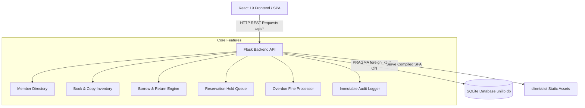

# 📚 UniLib — University Library Management System

[](https://react.dev/)
[](https://flask.palletsprojects.com/)
[](https://www.sqlite.org/)
[](https://vitejs.dev/)
[](LICENSE)

A modern, production-grade library management system built with **React (Vite)** frontend, **Python Flask** REST API backend, and lightweight **SQLite** storage.
No external database setup required — get running in seconds.

## ✨ Key Features

- **Book Catalog** — Add, search, filter, and delete books with multi-copy tracking
- **Member Management** — Students, librarians, and admins with detailed profile views
- **Borrow & Return** — Safe transactions with concurrency protection; prevents over-borrowing
- **Overdue Tracking** — Automatic overdue detection with configurable daily fine calculations
- **Fine Management** — Auto-generated fine records on return with one-click payment settlement
- **Reservation Queue** — Reserve currently unavailable books; automatically assigned on return
- **Audit Logging** — Every borrow, return, fine payment, and status mutation is recorded
- **Live Dashboard** — Real-time metrics, circulation stats, top books, and activity stream
- **System Health Checks** — Built-in `/api/health` monitoring for uptime and DB connection status

## Quick Start

### Development Mode (React + Flask separately)

```bash
# Terminal 1 — Start Flask API
pip install flask
python app.py

# Terminal 2 — Start React dev server
cd client
npm install
npm run dev
```

Open http://localhost:3000 — the Vite dev server proxies `/api` requests to Flask on port 5000.

### Production Mode (Flask serves React build)

```bash
# Build the React app
cd client
npm run build

# Start Flask (serves both API and React build)
pip install flask
python app.py
```

Open http://localhost:5000.

## 🏗️ Architecture Overview



## Project Structure


```
unilib/
├── app.py                  ← Flask app + all API routes
├── unilib.db               ← SQLite database (auto-created)
├── requirements.txt
├── client/                 ← React frontend
│   ├── package.json
│   ├── vite.config.js
│   ├── index.html
│   └── src/
│       ├── main.jsx        ← React entry point
│       ├── App.jsx         ← Main app with tab navigation
│       ├── App.css         ← Global styles
│       ├── services/api.js ← API client
│       └── components/
│           ├── Layout.jsx      ← Sidebar layout
│           ├── Dashboard.jsx   ← Stats dashboard
│           ├── BookList.jsx    ← Book catalog management
│           ├── MemberList.jsx  ← Member records
│           ├── BorrowForm.jsx  ← Issue / return / renew
│           ├── ReservationList.jsx ← Reservation queue
│           ├── FineList.jsx    ← Fine management
│           └── AuditLog.jsx    ← Audit log viewer
└── README.md
```

## API Endpoints

| Method | Path | Description |
|--------|------|-------------|
| GET | /api/health | Service & database health status |
| GET | /api/stats | Dashboard statistics |
| GET/POST | /api/books | List/add books |
| DELETE | /api/books/:id | Delete a book |
| GET/POST | /api/users | List/add members |
| DELETE | /api/users/:id | Remove a member |
| GET | /api/users/:id/profile | Member profile with active borrows, reservations, fines |
| GET/POST | /api/borrows | List/create borrows |
| POST | /api/borrows/:id/return | Return a book |
| POST | /api/borrows/:id/renew | Renew a borrow |
| GET/POST | /api/reservations | List/create reservations |
| POST | /api/reservations/:id/collect | Collect a ready hold |
| POST | /api/reservations/:id/cancel | Cancel a reservation |
| POST | /api/reservations/expire | Expire ready holds past TTL |
| GET | /api/fines | List all fines |
| POST | /api/fines/:id/pay | Mark fine as paid |
| GET | /api/audit | Audit log |
| POST | /api/admin/heal | Release orphaned reserved copies |

## Database Schema

```sql
users          — id, name, email, role, joined_at
books          — id, isbn, title, author, genre, total_copies, cover_color
book_copies    — id, book_id, status (available/borrowed/reserved)
borrows        — id, user_id, copy_id, borrowed_at, due_at, returned_at, renewals
reservations   — id, user_id, book_id, copy_id, reserved_at, hold_expires_at, status
fines          — id, borrow_id, amount, paid, created_at
audit_log      — id, table_name, record_id, action, details, changed_at
```

## Configuration & Environment Variables

| Variable | Default | Description |
|----------|---------|-------------|
| `PORT` | `5000` | Port for the Flask backend API server |
| `HOST` | `0.0.0.0` | Host IP binding address |
| `DEBUG` | `true` | Enable Flask debug mode & auto-reloading |
| `MAX_BORROWS` | `5` | Maximum active books per member |
| `MAX_RENEWALS` | `2` | Maximum renewal count per loan |
| `RENEWAL_DAYS` | `14` | Loan extension period in days |
| `FINE_PER_DAY` | `0.50` | Daily fine accumulation rate ($) |
| `HOLD_TTL_DAYS`| `3` | Number of days a ready reservation hold is reserved |

## Tech Stack

- **Frontend**: React 19 + Vite
- **Backend**: Python 3.8+ / Flask
- **Database**: SQLite (via built-in `sqlite3`)
- **Typography**: Playfair Display + DM Sans (Google Fonts)

## 🛠️ Troubleshooting & FAQ

<details>
<summary><b>Q: How do I reset the sample data in the database?</b></summary>

Simply stop the server, delete `unilib.db`, and start `app.py` again. A fresh database with default books, members, and sample circulation records will be created automatically on startup.
</details>

<details>
<summary><b>Q: How can I change the maximum number of borrowed books per user?</b></summary>

Edit the `MAX_BORROWS` constant in `app.py` or set it before initialization. The default limit is 5 books per member.
</details>

<details>
<summary><b>Q: How are reservation holds expired?</b></summary>

The backend checks reservation timestamps against `HOLD_TTL_DAYS`. You can trigger the cleanup anytime via `POST /api/reservations/expire` or use the Admin panel.
</details>

## 🤝 Contributing

1. Fork the repository
2. Create your feature branch (`git checkout -b feature/amazing-feature`)
3. Commit your changes (`git commit -m 'feat: add amazing feature'`)
4. Push to the branch (`git push origin feature/amazing-feature`)
5. Open a Pull Request

## 📄 License

This project is licensed under the MIT License — see the [LICENSE](LICENSE) file for details.

---

*Built to learn. Break things. Fix them. Repeat.*


